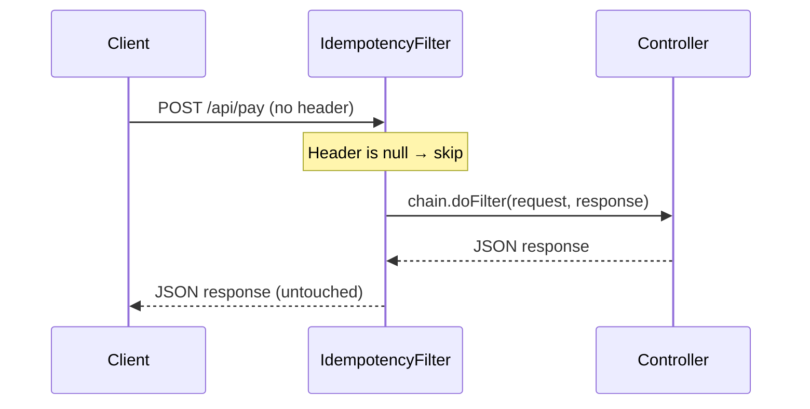
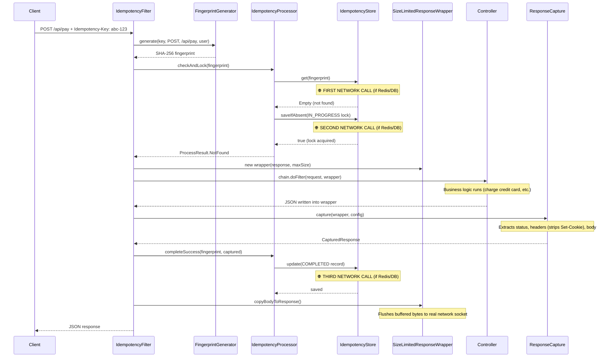
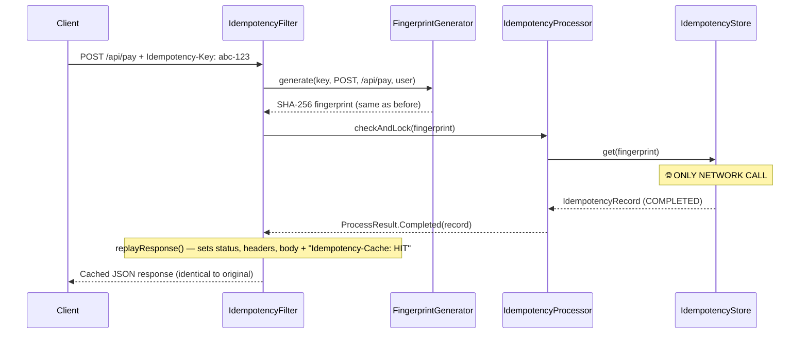
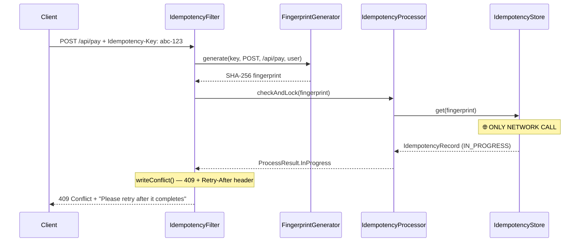
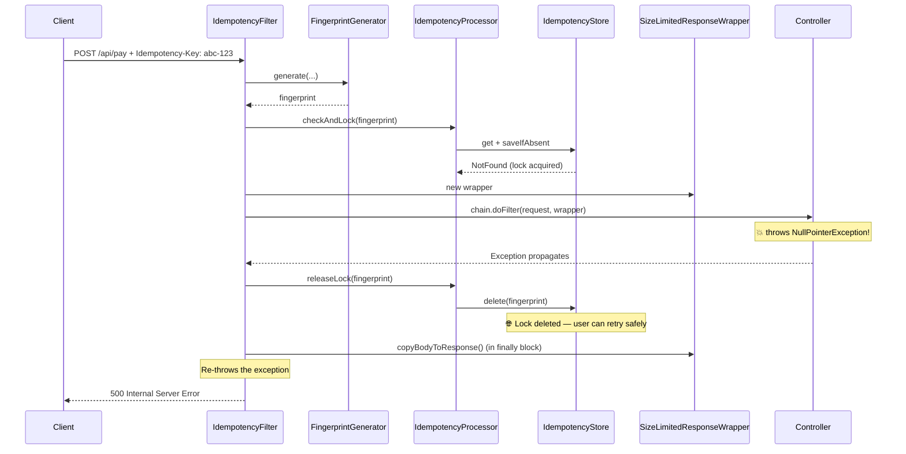

# Mode A — Global Filter Request Flow

> This document traces every class involved in a request when using **Mode A** (`IdempotencyFilter`), registered via `FilterRegistrationBean` for specific URL patterns.

## Classes Involved

| Class | Role |
|-------|------|
| `IdempotencyFilter` | The entry point. Handles everything: checking, locking, wrapping, capturing, saving. |
| `FingerprintGenerator` | Generates the SHA-256 fingerprint from key + method + URL + principal. |
| `IdempotencyProcessor` | The "Brain". Executes the state machine logic (check, lock, complete, release). |
| `IdempotencyStore` | The storage interface (Memory, Redis, or Postgres). |
| `SizeLimitedResponseWrapper` | The "Wiretap". Secretly captures the response body in memory. |
| `ResponseCapture` | The "Photographer". Takes a snapshot of the captured response, stripping forbidden headers. |
| `IdempotencyResponseWrapFilter` | **NOT USED in Mode A.** It may still run but detects the existing wrapper and skips. |

---

## Scenario 1: No `Idempotency-Key` Header

The user sends a normal request without any idempotency header.

### Step-by-step:

1. **`IdempotencyFilter`** reads the `Idempotency-Key` header → it is `null`.
2. The filter calls `chain.doFilter(request, response)` and returns immediately.
3. The request passes to the controller with **zero overhead**.

> **💡 Tip:** No fingerprint is generated. No store is contacted. No wrapper is created. The request is completely untouched.

---

## Scenario 2: Brand New Request (First Time)

The user clicks "Pay" for the first time with `Idempotency-Key: abc-123`.

### Step-by-step:

1. **`IdempotencyFilter`** — Reads the `Idempotency-Key` header. It exists and is valid.
2. **`FingerprintGenerator`** — Hashes key + HTTP method + URL + principal into a SHA-256 fingerprint. (Local CPU only, no network call.)
3. **`IdempotencyProcessor`** — The filter calls `checkAndLock()`.
4. **`IdempotencyStore`** — 🌐 The processor calls `store.get(fingerprint)`. The record does not exist.
5. **`IdempotencyStore`** — 🌐 The processor calls `store.saveIfAbsent(IN_PROGRESS)`. Lock is acquired.
6. **`IdempotencyProcessor`** — Returns `ProcessResult.NotFound` to the filter.
7. **`SizeLimitedResponseWrapper`** — The filter creates a new wrapper around the real response.
8. **Controller** — The filter calls `chain.doFilter(request, wrapper)`. The developer's business logic runs and writes JSON into the wrapper's secret buffer.
9. **`ResponseCapture`** — The filter calls `capture(wrapper, config)`. It extracts the status, strips forbidden headers (`Set-Cookie`), reads the body.
10. **`IdempotencyProcessor`** — The filter calls `completeSuccess()`. The processor tells the store to update the record to `COMPLETED`.
11. **`IdempotencyStore`** — 🌐 The store saves the complete record with TTL.
12. **`SizeLimitedResponseWrapper`** — The filter calls `copyBodyToResponse()`. The buffered bytes are flushed to Tomcat's real network socket.
13. **Client** — Receives the JSON response.

---

## Scenario 3: Duplicate Request (Already Completed)

The user's app retries the same payment 5 minutes later with the same `Idempotency-Key: abc-123`.

### Step-by-step:

1. **`IdempotencyFilter`** — Reads the header. Valid.
2. **`FingerprintGenerator`** — Generates the same SHA-256 fingerprint as before.
3. **`IdempotencyProcessor`** — Calls `checkAndLock()`.
4. **`IdempotencyStore`** — 🌐 Calls `store.get(fingerprint)`. The record exists with status `COMPLETED`.
5. **`IdempotencyProcessor`** — Returns `ProcessResult.Completed(record)`.
6. **`IdempotencyFilter`** — Calls `replayResponse()`. Sets the original status code, adds `Idempotency-Cache: HIT` header, replays all saved headers, writes the saved JSON body.
7. **The filter returns immediately.**

> **⚠️ Important:** No wrapper is created. No controller runs. No business logic executes. Only 1 network call to the store. The request is handled entirely inside the filter and never reaches Spring MVC.

---

## Scenario 4: Duplicate Request (Still In Progress — Double Click)

The user double-clicks "Pay". The first click is still being processed by another thread.

### Step-by-step:

1. **`IdempotencyFilter`** — Reads the header. Valid.
2. **`FingerprintGenerator`** — Generates the fingerprint.
3. **`IdempotencyProcessor`** — Calls `checkAndLock()`.
4. **`IdempotencyStore`** — 🌐 Calls `store.get(fingerprint)`. The record exists with status `IN_PROGRESS`.
5. **`IdempotencyProcessor`** — Returns `ProcessResult.InProgress`.
6. **`IdempotencyFilter`** — Calls `writeConflict()`. Sends HTTP `409 Conflict` with a `Retry-After` header and a JSON error body.

> **⚠️ Important:** No controller runs. The second click is instantly rejected. The client app should wait and retry after the `Retry-After` interval.

---

## Scenario 5: Controller Crashes (500 Error)

A new request arrives, the lock is acquired, but the controller throws an exception.

### Step-by-step:

1. Steps 1-7 are the same as Scenario 2 (new request, lock acquired, wrapper created).
2. **Controller** — The developer's code throws an exception (e.g., database is down).
3. **`IdempotencyFilter`** — The `catch` block fires. It calls `processor.releaseLock()`.
4. **`IdempotencyProcessor`** — Calls `store.delete(fingerprint)`.
5. **`IdempotencyStore`** — 🌐 Deletes the `IN_PROGRESS` lock from the store.
6. **`SizeLimitedResponseWrapper`** — The `finally` block calls `copyBodyToResponse()` to flush whatever is in the buffer.
7. **`IdempotencyFilter`** — Re-throws the exception so Spring can handle it normally.

> **⚠️ Important:** The lock is released. The user can safely retry the payment. The next retry will be treated as a brand new `NotFound` request.
