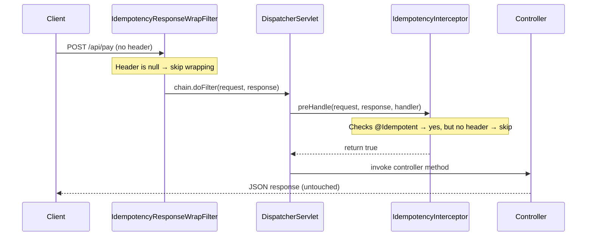
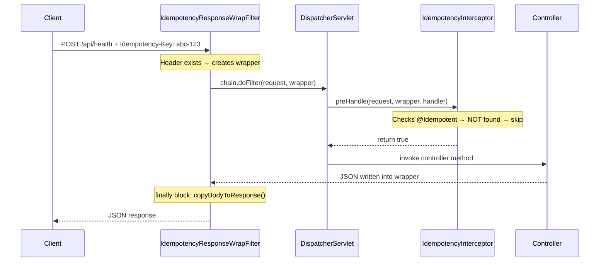
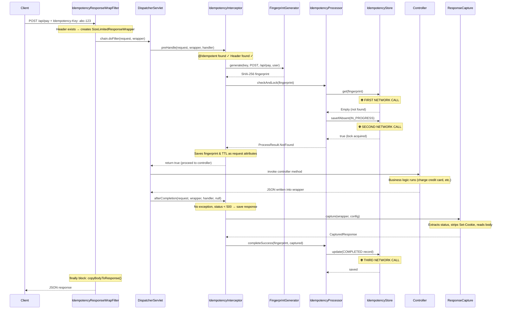
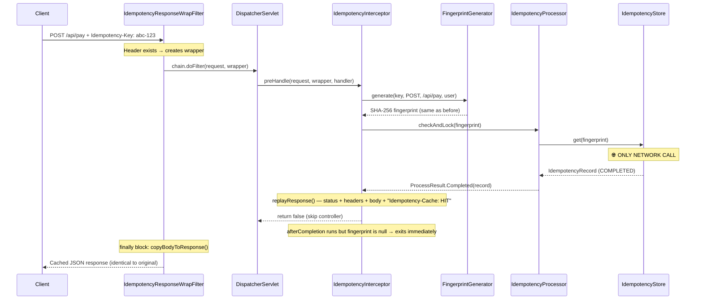
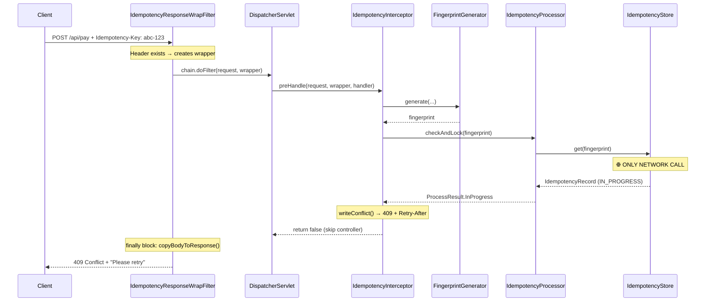
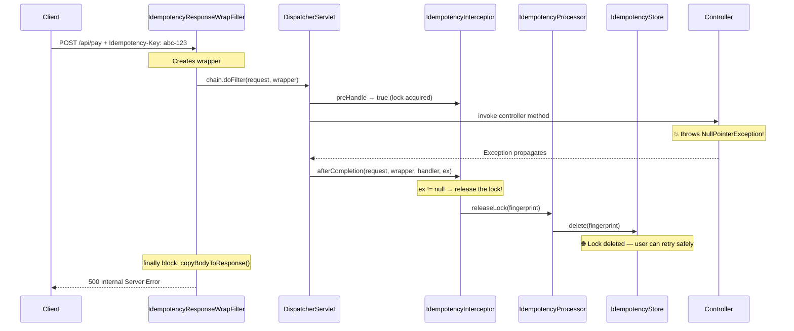

# Mode B — Interceptor Request Flow

> This document traces every class involved in a request when using **Mode B** (`@Idempotent` annotation + `IdempotencyInterceptor`), which is the default auto-configured mode.

## Classes Involved

| Class | Role |
|-------|------|
| `IdempotencyResponseWrapFilter` | The "Stage Crew". Wraps the response early so the Interceptor can read it later. |
| `IdempotencyWebMvcConfigurer` | Registers the Interceptor with Spring MVC at startup (not called per-request). |
| `IdempotencyInterceptor` | The main workhorse. Checks for `@Idempotent`, manages locking, captures responses. |
| `FingerprintGenerator` | Generates the SHA-256 fingerprint from key + method + URL + principal. |
| `IdempotencyProcessor` | The "Brain". Executes the state machine logic (check, lock, complete, release). |
| `IdempotencyStore` | The storage interface (Memory, Redis, or Postgres). |
| `SizeLimitedResponseWrapper` | The "Wiretap". Secretly captures the response body in memory. |
| `ResponseCapture` | The "Photographer". Takes a snapshot of the captured response, stripping forbidden headers. |
| `IdempotencyFilter` | **NOT USED in Mode B.** Mode A's filter is not registered in auto-configuration. |

---

## Scenario 1: No `Idempotency-Key` Header

The user sends a normal request without any idempotency header.

### Step-by-step:

1. **`IdempotencyResponseWrapFilter`** — Reads the header → `null`. Calls `chain.doFilter(request, response)` without wrapping.
2. **`IdempotencyInterceptor`** (`preHandle`) — Checks for `@Idempotent` annotation → found. Reads the header → `null`. Returns `true` immediately.
3. **Controller** — Runs normally. Zero overhead from the library.

> **💡 Tip:** No fingerprint is generated. No store is contacted. No wrapper is created. Both the filter and the interceptor skip instantly.

---

## Scenario 2: Controller Method Does NOT Have `@Idempotent`

The user sends a request with `Idempotency-Key` to an endpoint that is not annotated.

### Step-by-step:

1. **`IdempotencyResponseWrapFilter`** — Sees the header exists. Creates a `SizeLimitedResponseWrapper`. Passes the request down with the wrapper.
2. **`IdempotencyInterceptor`** (`preHandle`) — Checks the controller method for `@Idempotent` → annotation is missing. Returns `true` immediately.
3. **Controller** — Runs normally. Writes JSON into the wrapper.
4. **`IdempotencyResponseWrapFilter`** (`finally`) — Flushes the wrapper to the real network socket.

> **📝 Note:** The wrapper was created unnecessarily in this case because the filter cannot know at that point whether the destination controller has `@Idempotent`. This is a minor trade-off — creating a wrapper costs very little memory (starts at 1KB), and it gets cleaned up immediately.

---

## Scenario 3: Brand New Request (First Time)

The user clicks "Pay" for the first time with `Idempotency-Key: abc-123` on an `@Idempotent` endpoint.

### Step-by-step:

1. **`IdempotencyResponseWrapFilter`** — Sees the header. Creates the `SizeLimitedResponseWrapper`. Passes the request down.
2. **Spring MVC `DispatcherServlet`** — Routes the request to the correct controller.
3. **`IdempotencyInterceptor`** (`preHandle`) — Checks `@Idempotent` → found. Reads the header → valid.
4. **`FingerprintGenerator`** — Hashes key + method + URL + principal. (Local CPU, no network.)
5. **`IdempotencyProcessor`** — Calls `checkAndLock()`.
6. **`IdempotencyStore`** — 🌐 `store.get(fingerprint)` → not found. 🌐 `store.saveIfAbsent(IN_PROGRESS)` → lock acquired.
7. **`IdempotencyInterceptor`** — Saves `fingerprint` and `ttl` as request attributes (sticky notes for `afterCompletion`). Returns `true`.
8. **Controller** — The developer's business logic runs. JSON is written into the wrapper's secret buffer.
9. **`IdempotencyInterceptor`** (`afterCompletion`) — Spring calls this automatically after the controller finishes.
10. **`ResponseCapture`** — Extracts status, strips forbidden headers, reads body from wrapper.
11. **`IdempotencyProcessor`** — Calls `completeSuccess()`. Tells the store to update to `COMPLETED`.
12. **`IdempotencyStore`** — 🌐 Saves the complete record with TTL.
13. **`IdempotencyResponseWrapFilter`** (`finally`) — Flushes the wrapper to Tomcat's real network socket. Client receives the response.

---

## Scenario 4: Duplicate Request (Already Completed)

The user's app retries the same payment 5 minutes later with the same `Idempotency-Key: abc-123`.

### Step-by-step:

1. **`IdempotencyResponseWrapFilter`** — Creates wrapper (it cannot know the request is a duplicate yet).
2. **`IdempotencyInterceptor`** (`preHandle`) — Checks `@Idempotent` → found. Reads header → valid.
3. **`FingerprintGenerator`** — Generates the same fingerprint as before.
4. **`IdempotencyProcessor`** — Calls `checkAndLock()`.
5. **`IdempotencyStore`** — 🌐 `store.get(fingerprint)` → found with status `COMPLETED`.
6. **`IdempotencyInterceptor`** — Calls `replayResponse()`. Sets status, adds `Idempotency-Cache: HIT`, replays all headers, writes saved JSON body. Returns `false`.
7. **Controller NEVER runs.** No business logic. No database queries. No payment charged.
8. **`IdempotencyInterceptor`** (`afterCompletion`) — Spring calls it, but `fingerprint` attribute is `null` (was never saved), so it returns immediately.
9. **`IdempotencyResponseWrapFilter`** (`finally`) — Flushes the replayed response to the client.

> **⚠️ Important:** Only 1 network call to the store. The controller is completely skipped. The client receives an identical response to the original.

---

## Scenario 5: Duplicate Request (Still In Progress — Double Click)

The user double-clicks "Pay". The first click is still being processed by another thread.

### Step-by-step:

1. **`IdempotencyResponseWrapFilter`** — Creates wrapper.
2. **`IdempotencyInterceptor`** (`preHandle`) — Checks `@Idempotent` → found.
3. **`FingerprintGenerator`** — Generates fingerprint.
4. **`IdempotencyProcessor`** — Calls `checkAndLock()`.
5. **`IdempotencyStore`** — 🌐 Record exists with status `IN_PROGRESS`.
6. **`IdempotencyInterceptor`** — Calls `writeConflict()`. Sends `409 Conflict` + `Retry-After` header + JSON error body. Returns `false`.
7. **Controller NEVER runs.** The double-click is instantly rejected.
8. **`IdempotencyResponseWrapFilter`** (`finally`) — Flushes the 409 error to the client.

---

## Scenario 6: Controller Crashes (500 Error / Exception)

A new request arrives, the lock is acquired, but the controller throws an exception.

### Step-by-step:

1. Steps 1-7 are the same as Scenario 3 (new request, lock acquired, wrapper created).
2. **Controller** — The developer's code throws an exception.
3. **`IdempotencyInterceptor`** (`afterCompletion`) — Spring passes the exception as `ex`. The interceptor sees `ex != null`, so it calls `processor.releaseLock()`.
4. **`IdempotencyProcessor`** — Calls `store.delete(fingerprint)`.
5. **`IdempotencyStore`** — 🌐 Deletes the `IN_PROGRESS` lock from the store.
6. **`IdempotencyResponseWrapFilter`** (`finally`) — Flushes whatever is in the buffer.
7. Spring handles the exception and sends `500 Internal Server Error` to the client.

> **⚠️ Important:** The lock is released. The user can safely retry the payment. The next retry will be treated as a brand new `NotFound` request.

---

## Mode A vs Mode B — Summary Comparison

| Feature | Mode A (Global Filter) | Mode B (Interceptor) |
|---------|----------------------|---------------------|
| Entry Point | `IdempotencyFilter` | `IdempotencyResponseWrapFilter` |
| Activation | URL patterns (e.g., `/api/*`) | `@Idempotent` annotation per method |
| First store call happens at | Filter layer (very early) | Interceptor layer (after DispatcherServlet) |
| Wrapper created by | `IdempotencyFilter` itself | `IdempotencyResponseWrapFilter` (separate class) |
| Duplicate request efficiency | 🟢 Faster (stops at filter, never reaches Spring MVC) | 🟡 Slightly slower (passes through filter + DispatcherServlet before interceptor stops it) |
| Configuration required | Manual `FilterRegistrationBean` in a `@Configuration` class | Zero — auto-configured, just add `@Idempotent` |
| Best for | Protecting entire URL paths without modifying controllers | Protecting specific endpoints with fine-grained control |
